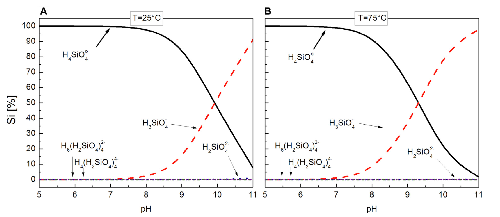

```{r setup, include=FALSE}
library(tufte)
library(ggplot2)
library(readxl)
library(plotly)
#library(reshape2)
library(gtools)
library(MASS)
library(ggridges)
library(pracma)
library(viridis)
library(colorspace)
library(dplyr)
library(tidyr)
library(zoo)


#library(formatR)
# invalidate cache when the tufte version changes
knitr::opts_chunk$set(tidy = FALSE, echo = FALSE, cache=FALSE,warning = FALSE, message = FALSE)
options(htmltools.dir.version = FALSE)
```


```{r Define theme white, include=FALSE, echo=FALSE}
# Define white theme (handouts) ------------------------------------------------------
theme_white = function(base_size = 12, base_family = "") {
  
  theme_grey(base_size = base_size, base_family = base_family) %+replace%
    
    theme(
      # Specify axis options
      axis.line = element_blank(),  
      axis.text.x = element_text(size = base_size*0.8, color = "black", lineheight = 0.9, face = "bold"),  
      axis.text.y = element_text(size = base_size*0.8, color = "black", lineheight = 0.9, face = "bold"),  
      axis.ticks = element_line(color = "black", size  =  0.2),  
      axis.title.x = element_text(size = base_size, color = "black", margin = margin(0, 10, 0, 0), face = "bold"),  
      axis.title.y = element_text(size = base_size, color = "black", angle = 90, margin = margin(0, 10, 0, 0), face = "bold"),  
      axis.ticks.length = unit(0.3, "lines"),   
      # Specify legend options
      legend.background = element_rect(color = NA, fill = "white"),  
      legend.key = element_rect(color = "black",  fill = "white"),  
      legend.key.size = unit(1.2, "lines"),  
      legend.key.height = NULL,  
      legend.key.width = NULL,      
      legend.text = element_text(size = base_size*0.8, color = "black"),  
      legend.title = element_text(size = base_size*0.8, face = "bold", hjust = 0, color = "black"),  
      legend.position = "right",  
      legend.text.align = NULL,  
      legend.title.align = NULL,  
      legend.direction = "vertical",  
      legend.box = NULL, 
      # Specify panel options
      panel.background = element_rect(fill = "white", color  =  NA),  
      panel.border = element_rect(fill = NA, color = "black"),  
      panel.grid.major = element_line(color = "grey35", size=0.05),  
      panel.grid.minor = element_line(color = "grey20", size=0.05),  
      panel.margin = unit(0.5, "lines"),   
      # Specify facetting options
      strip.background = element_rect(fill = "grey30", color = "grey10"),  
      strip.text.x = element_text(size = base_size*0.8, color = "black"),  
      strip.text.y = element_text(size = base_size*0.8, color = "black",angle = -90),  
      # Specify plot options
      plot.background = element_rect(color = "white", fill = "white"),  
      plot.title = element_text(size = base_size*1.2, color = "black"),  
      plot.margin = unit(rep(1, 4), "lines")
      
    )
  
}
```

\newcommand{\mathalert}[1]{\textcolor{red}{\mathbf{#1}}}

```{=tex}
\marginnote{This is an R Markdown document. Markdown is a simple formatting syntax for authoring HTML, PDF, and MS Word documents. For more details on using R Markdown see <http://rmarkdown.rstudio.com>.

When you click the **Knit** button a document will be generated that includes both content as well as the output of any embedded R code chunks within the document.  It is similar to a jupyter notebook that you might be more familiar with.  You can both explore the code, and also compile the final document to pdf output.  This should provide you with some familiarisation of "R", as well as the science.}
```


This practical will take place on your laptops via a web-browser (hopefully).  Click on [this link](http://mybinder.org/v2/gh/ett20/PIII_O27_Depaolo/main?urlpath=rstudio) to open it.    This will open a Binder webpage which will compile into an interface that is identical to the RStudio App (it will take a few minutes to open).  Some of you will be familiar with this app, but if you have never used if before you will need to spend a few minutes familiarising yourself with it and making sure you know how to run R.  Alternatively the practical can be run using RStudio on your own computers.


The interpretation of stable isotope signatures in natural systems requires knowledge of the equilibrium isotope fractionation between the mineral phase and aqueous fluid from which the mineral precipitated.   This practical attempts to illustrate how this might be done for silicon isotopes, between amorphous silica, and aqueous fluids.  The data are from a study where the 3-isotope method was used.  By looking at the data in some detail, and trying to recreate some of the diagrams from the paper, the complexity of even the simplest experiments is illustrated.  This really highlights the need for talented experimental geochemists.

A critical factor to determine the equilibrium fractionation between a mineral and its coexisting aqueous fluid is the aqueous speciation of the system.  Aqueous Si speciation depends on the solution pH and total dissolved Si concentration.  Aqueous silicon speciation is dominated by silicic acid ($H_4SiO^o_4$) in most natural aqueous fluids at pH \textless\ 8.5, but forms $H_3SiO_4^-$, $H_2SiO_4^{2-}$, and polymeric Si species in more alkaline fluids.


```{r, fig.fullwidth=FALSE,  include=TRUE, fig.align="center", out.width="0.8\\linewidth",  fig.cap=c("Distribution of aqueous Si species in equilibrium with amorphous silica as a function of pH calculated with PHREEQC using its llnl database, for A. 25C and B. 75C. Notice that at 75 C the increase in the concentration of the $H_3SiO_4^-$ species occurs at a lower pH than at 25C"), echo=FALSE}

```


The experiments in the present study were begun by first equilibrating an initially Si free aqueous solution of known pH with amorphous silica. The dissolution reaction for amorphous silica is described by:


\begin{equation}
SiO2_{am} + 2H_2O \rightarrow H4SiO_4^0
\end{equation}


# QUESTION: Write down the equilibrium constant for reaction X


Silicon isotope compositions are reported using the standard delta-notation in per mil (\textperthousand) relative to the international NBS-28 standard, calculated using:


\begin{equation}
\delta^{30}Si=10^3 \cdot \left\{\frac{(\frac{^{30}Si}{^{28}Si})}{(\frac{^{30}Si}{^{28}Si})}-1\right\}
\end{equation}

and 

\begin{equation}
\delta^{29}Si=10^3 \cdot \left\{\frac{(\frac{^{29}Si}{^{28}Si})}{(\frac{^{29}Si}{^{28}Si})}-1\right\}
\end{equation}


# QUESTION: Write down the fractionation factors for the above reaction for both the $^{30}Si/^{28}Si$ and $^{29}Si/^{28}Si$ ratios in both $\alpha$ and $\Delta$ notation for the reaction between amorphous silica and $H_4SiO_4$.

To attempt to assure the attainment of isotopic equilibrium, the ‘three-isotope method’ was applied.  The equilibrated solutions were then "spiked" with $^{29}Si$ to enrich the solutions to a $\delta^{29}Si$ value of approximately 23 \textperthousand.  After the addition of this spike to the equilibrated fluids, the Si concentration and pH were measured. The fluid pH was adjusted, if necessary, by adding a small quantity of HCl or NH4OH to assure these initial fluids were as close to equilibrium with amorphous silica as possible.

Four sets of isotopic exchange experiments were conducted, to attempt to determine the Si isotope fractionation factor as a function of both pH and temperature (25C and 75C).

Each individual experiment was performed in 10 ml polypropylene reactors. Into each reactor was added 0.15g of amorphous \ce{SiO2} powder with a known Si isotope composition and 5 ml of the prepared $^{29}Si$ enriched fluid.  Each reactor was sampled for both fluid and amorphous silica at a given point in time for just over a year.


# QUESTION: Read in the data from Stamm et al., and plot pH as a function of time for each of the 4 sets of experimental conditions.  Comment on the changes in pH.  Why do you think the high temperaature experiemnts were run at higher pH than the lower temperature experiments?

```{r Read Stamm-2019 data and plot pH,  warning=FALSE, message=FALSE, echo=FALSE, include=FALSE}
#Define what to do if there is missing data
na_strings <- c("NA", "n.d.", "N/A", "na","n.a.","","-","–","-9999","NAN")
#Define a filename
filename<-"Stamm_2019.xlsx"
#Read in the data from xlsx

Stamm_2019<-as.data.frame(read_excel(filename, na = na_strings, skip=1, sheet="Sheet2", col_names = TRUE))
head(Stamm_2019)


#Note, chances are there will be bugs across platforms because of the col headers


colnames(Stamm_2019)

#Clean up a bit
Stamm_2019<-Stamm_2019%>%drop_na(`Exp. ID`)
#Stamm_2019<-Stamm_2019%>%drop_na(`Exp. ID`)%>%group_by("Expt","Type")


ytitle<-~paste(delta^{29},'Si',' [\u2030]') 
xtitle<-~paste(delta^{30},'Si',' [\u2030]') 


 Stamm_2019_pH_time<-ggplot()+
  geom_point(data=Stamm_2019%>%filter(Type=="Aqueous solution"), aes(y=pH, x=`Elapsed time`, color=as.factor(Expt)))+
  #scale_color_viridis()+
  theme_white()+
  theme(
    legend.position = "right",
    #legend.justification = c("top", "right"),
    #legend.box.just = "right",
    #legend.margin = margin(6, 6, 6, 6),
    #legend.key.height= unit(0.5, 'cm'),
    legend.key.width= unit(0.3, 'cm'),
    legend.title = element_text(size=6), #change legend title font size
    legend.text = element_text(size=6) #change legend text font size
  )+
  scale_x_continuous(name="Time [days]")+
  scale_y_continuous(name="pH")+
  labs(color = "Experiment")
  
```


```{r Display_Stamm_2019_pH_time,  warning=FALSE, message=FALSE, echo=FALSE, fig.margin = TRUE, fig.cap="Plot of time (x-axis) versus the measured pH for each of the 4 experiments."}
Stamm_2019_pH_time
```


# QUESTION: Plot the Si concentration as a function of time for each of the 4 sets of experimental conditions.  Note that this is the total Si concentration, and that in solution this could have existed as multiple Si species.  Comment on the trends in the data.  The experiments were intended to be designed such that the solution and amorphous \ce{SiO2} were in equilibrium from the start of the experiment.  Do you think this was the case for every experiment?

```{r Read Stamm-2019 data and plot DSi,  warning=FALSE, message=FALSE, echo=FALSE, include=FALSE}


#Note, chances are there will be bugs across platforms because of the col headers


colnames(Stamm_2019)

#Clean up a bit
Stamm_2019<-Stamm_2019%>%drop_na(`Exp. ID`)
#Stamm_2019<-Stamm_2019%>%drop_na(`Exp. ID`)%>%group_by("Expt","Type")


 Stamm_2019_DSi_time<-ggplot()+
  geom_point(data=Stamm_2019%>%filter(Type=="Aqueous solution"), aes(y=`Si-conc.`, x=`Elapsed time`, color=as.factor(Expt)))+
  #scale_color_viridis()+
  theme_white()+
  theme(
    legend.position = "right",
    #legend.justification = c("top", "right"),
    #legend.box.just = "right",
    #legend.margin = margin(6, 6, 6, 6),
    #legend.key.height= unit(0.5, 'cm'),
    legend.key.width= unit(0.3, 'cm'),
    legend.title = element_text(size=6), #change legend title font size
    legend.text = element_text(size=6) #change legend text font size
  )+
  scale_x_continuous(name="Time [days]")+
  scale_y_continuous(name="Si [ppm]")+
  labs(color = "Experiment")
  
```

```{r Display_Stamm_2019_DSi_time,  warning=FALSE, message=FALSE, echo=FALSE, fig.margin = TRUE, fig.cap="Plot of time (x-axis) versus the total Si concentration in solution for each of the 4 experiments."}
Stamm_2019_DSi_time
```


# QUESTION: Plot the $\delta^29Si$ solution data as a function of time for each of the 4 sets of experimental conditions.  Comment on the trends in the data. In particular, consider the evidence for the dissolution reaction, compared to the precipitation reaction.  Contrast with your answer to the previous question where you examined the total Si concentration.

```{r plot d29Si,  warning=FALSE, message=FALSE, echo=FALSE, include=FALSE}


#Note, chances are there will be bugs across platforms because of the col headers


colnames(Stamm_2019)

#Clean up a bit
Stamm_2019<-Stamm_2019%>%drop_na(`Exp. ID`)%>%drop_na(F.)
#Stamm_2019<-Stamm_2019%>%drop_na(`Exp. ID`)%>%group_by("Expt","Type")


Stamm_2019<-Stamm_2019%>%mutate(facet_var=paste(Type, Expt))
dput(levels(factor(Stamm_2019$facet_var)))


plot_order<-c("Amorphous SiO2 SibA", "Aqueous solution SibA", "Amorphous SiO2 SicB", "Aqueous solution SicB","Amorphous SiO2 Sig75A", "Aqueous solution Sig75A","Amorphous SiO2 Sik75B", "Aqueous solution Sik75B")


Stamm_2019<-arrange(mutate(Stamm_2019,
             facet_var2=factor(facet_var,levels=plot_order)),facet_var)

ytitle<-~paste(delta^{29},'Si',' [\u2030]') 


 
  Stamm_2019_d29Si_time_1<-ggplot()+
  geom_point(data=Stamm_2019, aes(y=`δ29Si`, x=`Elapsed time`, color=Type), size=5)+
  #scale_color_viridis()+
  theme_white()+
  theme(
    legend.position = c(1.1, .74),
    #legend.justification = c("top", "right"),
    #legend.box.just = "right",
    #legend.margin = margin(6, 6, 6, 6),
    #legend.key.height= unit(0.5, 'cm'),
    legend.key.width= unit(0.3, 'cm'),
    legend.title = element_text(size=6), #change legend title font size
    legend.text = element_text(size=6), #change legend text font size
    #strip.background = element_rect(color="black", fill="#FC4E07", size=1.5, linetype="solid"),
    strip.background = element_blank())+
  scale_x_continuous(name="Time [days]")+
  scale_y_continuous(name=ytitle)+
  labs(color = "Experiment")+
  facet_wrap(as.factor(Stamm_2019$facet_var2), ncol=2,scales = "free")
  
 
  
```

```{r Display_Stamm_2019_d29Si_time_1,  warning=FALSE, message=FALSE, echo=FALSE, fig.width = 10, fig.height = 12, fig.fullwidth = TRUE, fig.cap="Plot of time (x-axes) versus $delta^{29}Si$  in solution and amorphous silica for each of the 4 experiments."}
Stamm_2019_d29Si_time_1
```


# QUESTION: Why do you think $\delta^{29}Si$ only evolves by a small amount for the amorphous Silica, compared with the aqueous $\delta^{29}Si$?

To answer the previous question, hopefully you realised that it would be useful to calculate the $\delta^{29}Si$ of the bulk system.  Happily this can be done with the data provided in the paper.

# QUESTION:  Calculate the $\delta^{29}Si$ of the bulk system.   


Recall the volume of the liquid in each of the experiments was 5ml, and 0.15g of amorphous silica was used for each experiment.   

```{r calculate bulk d29Si,  warning=FALSE, message=FALSE, echo=FALSE, include=FALSE}
Stamm_2019_d29Si_bulk<-as.data.frame(read_excel(filename, na = na_strings, skip=0, sheet="Sheet3", col_names = TRUE))
head(Stamm_2019)

Stamm_2019_d29Si_bulk<-Stamm_2019_d29Si_bulk%>%mutate(`M_aq [mg]`=`Initial Si conc ppm`*`Vol ml`/1000,
                                                      `M_amorph [mg]`=`Mass_am g`*1000,
                                                      d29Si_bulk=(`M_aq [mg]`*d29Si_aq+`M_amorph [mg]`*d29Si_am)/(`M_aq [mg]`+`M_amorph [mg]`))
  
```
# QUESTION:  Add the bulk $\delta^{29}Si$ to your plots from above, by running the chunnk of code below.  It should appear as a grey bar.  Look carefully at the plots and consider whether the data is completely self consistent from a mass balance point of view (assuming the bulk $\delta^{29}Si$ was calculated correctly)

```{r plot d29Si with bulk ribbon,  warning=FALSE, message=FALSE, echo=FALSE, include=FALSE}
#Stamm_2019_d29Si_bulk%>%dplyr::select(Expt,d26Si_bulk)

Stamm_2019<-left_join(Stamm_2019, Stamm_2019_d29Si_bulk%>%dplyr::select(Expt,d29Si_bulk), by="Expt")
  
Stamm_2019_d29Si_time_2<-ggplot()+
  geom_point(data=Stamm_2019, aes(y=`δ29Si`, x=`Elapsed time`, color=Type), size=5)+
  geom_ribbon(data=Stamm_2019, aes(x=`Elapsed time`, ymin=d29Si_bulk-0.1, ymax=d29Si_bulk+0.1), alpha=0.3)+
  #scale_color_viridis()+
  theme_white()+
  theme(
    legend.position = c(1.1, .74),
    #legend.justification = c("top", "right"),
    #legend.box.just = "right",
    #legend.margin = margin(6, 6, 6, 6),
    #legend.key.height= unit(0.5, 'cm'),
    legend.key.width= unit(0.3, 'cm'),
    legend.title = element_text(size=6), #change legend title font size
    legend.text = element_text(size=6), #change legend text font size
    #strip.background = element_rect(color="black", fill="#FC4E07", size=1.5, linetype="solid"),
    strip.background = element_blank())+
  scale_x_continuous(name="Time [days]")+
  scale_y_continuous(name=ytitle)+
  labs(color = "Experiment")+
  facet_wrap(as.factor(Stamm_2019$facet_var2), ncol=2,scales = "free")
  


```


```{r Display_Stamm_2019_d29Si_time_2,  warning=FALSE, message=FALSE, echo=FALSE, fig.width = 10, fig.height = 12, fig.fullwidth = TRUE, fig.cap="Plot of time (x-axes) versus $delta^{29}Si$  in solution and amorphous silica for each of the 4 experiments.  The horizontal grey bars indicate the estimated $delta^{29}Si$ of the bulk (aqueous+amorphous) Si."}
Stamm_2019_d29Si_time_2
```


It is possible to calculate the $\delta^30Si$ of the bulk reaction vessel alternatively using the aqueous and amorphous $\delta^30Si$ and their respective concentrations at each time-step.

# QUESTION:  Calculate the bulk $\delta^{29}Si$ via this alternative method by running the following chunk of code

```{r calculate bulk d29Si method 2,  warning=FALSE, message=FALSE, echo=FALSE, include=FALSE}

levels(factor(Stamm_2019$Expt))

#-------------------------
SibA<-left_join(Stamm_2019%>%filter(Expt=="SibA", Type=="Aqueous solution"),
Stamm_2019%>%filter(Expt=="SibA", Type=="Amorphous SiO2")%>%dplyr::select(`Elapsed time`,δ29Si),
by="Elapsed time")%>%rename(δ29Si_aq=δ29Si.x, δ29Si_am=δ29Si.y)

  
SibA<-SibA%>%mutate(
  `M_aq [mg]`=`Si-conc.`*5/1000,
  `Delta_M_aq [mg]`=`M_aq [mg]`-`M_aq [mg]`[1], #This is the change is the mass of aqueous Si, which either must have been gained from or lost to amorphous Si.
  `M_amorph [mg]`=0.15*1000-`Delta_M_aq [mg]`, #This assumes the total mass is const.  Should be a good assumption
  delta29Si_bulk2=(`Delta_M_aq [mg]`*δ29Si_aq+`M_amorph [mg]`*δ29Si_am)/(`Delta_M_aq [mg]`+`M_amorph [mg]`)
  )

#-------------------------
SicB<-left_join(Stamm_2019%>%filter(Expt=="SicB", Type=="Aqueous solution"),
Stamm_2019%>%filter(Expt=="SicB", Type=="Amorphous SiO2")%>%dplyr::select(`Elapsed time`,δ29Si),
by="Elapsed time")%>%rename(δ29Si_aq=δ29Si.x, δ29Si_am=δ29Si.y)

  
SicB<-SicB%>%mutate(
  `M_aq [mg]`=`Si-conc.`*5/1000,
  `Delta_M_aq [mg]`=`M_aq [mg]`-`M_aq [mg]`[1], #This is the change is the mass of aqueous Si, which either must have been gained from or lost to amorphous Si.
  `M_amorph [mg]`=0.15*1000-`Delta_M_aq [mg]`, #This assumes the total mass is const.  Should be a good assumption
  delta29Si_bulk2=(`Delta_M_aq [mg]`*δ29Si_aq+`M_amorph [mg]`*δ29Si_am)/(`Delta_M_aq [mg]`+`M_amorph [mg]`)
  )

#-------------------------
Sig75A<-left_join(Stamm_2019%>%filter(Expt=="Sig75A", Type=="Aqueous solution"),
Stamm_2019%>%filter(Expt=="Sig75A", Type=="Amorphous SiO2")%>%dplyr::select(`Elapsed time`,δ29Si),
by="Elapsed time")%>%rename(δ29Si_aq=δ29Si.x, δ29Si_am=δ29Si.y)

  
Sig75A<-Sig75A%>%mutate(
  `M_aq [mg]`=`Si-conc.`*5/1000,
  `Delta_M_aq [mg]`=`M_aq [mg]`-`M_aq [mg]`[1], #This is the change is the mass of aqueous Si, which either must have been gained from or lost to amorphous Si.
  `M_amorph [mg]`=0.15*1000-`Delta_M_aq [mg]`, #This assumes the total mass is const.  Should be a good assumption
  delta29Si_bulk2=(`Delta_M_aq [mg]`*δ29Si_aq+`M_amorph [mg]`*δ29Si_am)/(`Delta_M_aq [mg]`+`M_amorph [mg]`)
  )

#-------------------------
Sik75B<-left_join(Stamm_2019%>%filter(Expt=="Sik75B", Type=="Aqueous solution"),
Stamm_2019%>%filter(Expt=="Sik75B", Type=="Amorphous SiO2")%>%dplyr::select(`Elapsed time`,δ29Si),
by="Elapsed time")%>%rename(δ29Si_aq=δ29Si.x, δ29Si_am=δ29Si.y)

  
Sik75B<-Sik75B%>%mutate(
  `M_aq [mg]`=`Si-conc.`*5/1000,
  `Delta_M_aq [mg]`=`M_aq [mg]`-`M_aq [mg]`[1], #This is the change is the mass of aqueous Si, which either must have been gained from or lost to amorphous Si.
  `M_amorph [mg]`=0.15*1000-`Delta_M_aq [mg]`, #This assumes the total mass is const.  Should be a good assumption
  delta29Si_bulk2=(`Delta_M_aq [mg]`*δ29Si_aq+`M_amorph [mg]`*δ29Si_am)/(`Delta_M_aq [mg]`+`M_amorph [mg]`)
  )


Stamm_2019<-Stamm_2019%>%arrange(Expt, Type,`Elapsed time`)
#Stamm_2019$Expt
t<-rbind(SibA,SibA,SicB,SicB,Sig75A,Sig75A,Sik75B,Sik75B)

Stamm_2019<-cbind(Stamm_2019,t$delta29Si_bulk2)

Stamm_2019<-Stamm_2019%>%rename("d29Si_bulk2"=`t$delta29Si_bulk2`)

#Stamm_2019<-arrange(mutate(Stamm_2019,
#             facet_var2=factor(facet_var,levels=plot_order)),facet_var)


Stamm_2019<-Stamm_2019%>%arrange(facet_var2)
#View(Stamm_2019)

```


# QUESTION:  Remake the $\delta^{29}Si$ plots with the revised estimate of the bulk $\delta^{29}Si$ to your plots.


```{r plot d29Si with bulk ribbon based on mass balance,  warning=FALSE, message=FALSE, echo=FALSE, include=FALSE}

  
Stamm_2019_d29Si_time_3<-ggplot()+
  geom_point(data=Stamm_2019, aes(y=`δ29Si`, x=`Elapsed time`, color=Type), size=5)+
  geom_ribbon(data=Stamm_2019, aes(x=`Elapsed time`, ymin=d29Si_bulk2-0.1, ymax=d29Si_bulk2+0.1), alpha=0.3)+
  #scale_color_viridis()+
  theme_white()+
  theme(
    legend.position = c(1.1, .74),
    #legend.justification = c("top", "right"),
    #legend.box.just = "right",
    #legend.margin = margin(6, 6, 6, 6),
    #legend.key.height= unit(0.5, 'cm'),
    legend.key.width= unit(0.3, 'cm'),
    legend.title = element_text(size=6), #change legend title font size
    legend.text = element_text(size=6), #change legend text font size
    #strip.background = element_rect(color="black", fill="#FC4E07", size=1.5, linetype="solid"),
    strip.background = element_blank())+
  scale_x_continuous(name="Time [days]")+
  scale_y_continuous(name=ytitle)+
  labs(color = "Experiment")+
  facet_wrap(as.factor(Stamm_2019$facet_var2), ncol=2,scales = "free")
  

```


```{r Display_Stamm_2019_d29Si_time_3,  warning=FALSE, message=FALSE, echo=FALSE, fig.width = 10, fig.height = 12, fig.fullwidth = TRUE, fig.cap="Plot of time (x-axes) versus $delta^{29}Si$  in solution and amorphous silica for each of the 4 experiments.  The grey shaded areas indicate the estimated $delta^{29}Si$ of the bulk (aqueous+amorphous) Si, calculated using the $delta^{29}Si$ values of the solutions and amorphous SiO2 at each time step."}
Stamm_2019_d29Si_time_3
```


# QUESTION: Plot the $\delta^30Si$ solution data as a function of time for each of the 4 sets of experimental conditions.  Comment on the trends in the data. 

```{r plot d30Si,  warning=FALSE, message=FALSE, echo=FALSE, include=FALSE}


#Note, chances are there will be bugs across platforms because of the col headers


colnames(Stamm_2019)

#Clean up a bit
Stamm_2019<-Stamm_2019%>%drop_na(`Exp. ID`)
#Stamm_2019<-Stamm_2019%>%drop_na(`Exp. ID`)%>%group_by("Expt","Type")

ytitle<-~paste(delta^{30},'Si',' [\u2030]') 


Stamm_2019<-Stamm_2019%>%mutate(facet_var=paste(Type, Expt))
dput(levels(factor(Stamm_2019$facet_var)))


plot_order<-c("Amorphous SiO2 SibA", "Aqueous solution SibA", "Amorphous SiO2 SicB", "Aqueous solution SicB","Amorphous SiO2 Sig75A", "Aqueous solution Sig75A","Amorphous SiO2 Sik75B", "Aqueous solution Sik75B")

Stamm_2019<-arrange(mutate(Stamm_2019,
             facet_var2=factor(facet_var,levels=plot_order)),facet_var)

  
  
  
  Stamm_2019_d30Si_time<-ggplot()+
  geom_point(data=Stamm_2019, aes(y=`δ30Si`, x=`Elapsed time`, color=Type), size=5)+
  geom_errorbar(data=Stamm_2019, aes(y=`δ30Si`, x=`Elapsed time`,ymin=`δ30Si`-0.1, ymax=`δ30Si`+0.1))+
  #scale_color_viridis()+
  theme_white()+
  theme(
    legend.position = c(1.1, .74),
    #legend.justification = c("top", "right"),
    #legend.box.just = "right",
    #legend.margin = margin(6, 6, 6, 6),
    #legend.key.height= unit(0.5, 'cm'),
    legend.key.width= unit(0.3, 'cm'),
    legend.title = element_text(size=6), #change legend title font size
    legend.text = element_text(size=6), #change legend text font size
    strip.background = element_blank())+
  scale_x_continuous(name="Time [days]")+
  scale_y_continuous(name=ytitle)+
  labs(color = "Experiment")+
  facet_wrap(as.factor(Stamm_2019$facet_var2), ncol=2,scales = "free")
 
  
```
```{r Display_Stamm_2019_d30Si_time,  warning=FALSE, message=FALSE, echo=FALSE, fig.width = 10, fig.height = 12, fig.fullwidth = TRUE,fig.cap="Plot of time (x-axes) versus $delta^{30}Si$  in solution and amorphous silica for each of the 4 experiments.  The grey shaded areas indicate the estimated $delta^{30}Si$ of the bulk (aqueous+amorphous) Si, calculated using the $delta^{30}Si$ values of the solutions and amorphous SiO2 at each time step."}
Stamm_2019_d30Si_time
```

If all the data are self-consistent, and equilibration has occurred then it should be possible to understand the data on a three-isotope plot.
If isotopic equilibrium is attained:


\begin{equation}
\alpha_{i/k}=(\alpha_{j/k})^\beta\,\,\,\,\,\,\,\,\,\, \beta=\frac{\left(\frac{1}{m_k}-\frac{1}{m_i}\right)}{\left(\frac{1}{m_k}-\frac{1}{m_j}\right)}
\end{equation}

The precise masses of silicon are:- $^{28}Si$=27.9769271 , $^{29}Si$=28.9764949 , $^{30}Si$=29.9737707 


# QUESTION: Determine the $\beta$ value
```{r Calculate Beta,  warning=FALSE, message=FALSE, echo=FALSE, include=FALSE}
m28Si<-27.9769271
m29Si<-28.9764949
m30Si<-29.9737707

Beta<-(1/m28Si-1/m29Si)/(1/m28Si-1/m30Si)

Beta

```

The $\beta$ value is approximately equal to the slope on a 3-isotope plot.

# QUESTION:  Assuming that the terrestrial fractionation line passes through the origin (implying that the standard NBS-28 has a delta value of zero), make a rapid 3-isotope plot.  You may want to consider why the slope is only approximate.  Add to your plot the secondary mass fractionation line for the experiment SibA for both the initial fluid and the bulk system.


```{r calculate empty 3_isotope plot,  warning=FALSE, message=FALSE, echo=FALSE, include=FALSE}

ytitle<-~paste(delta^{29},'Si',' [\u2030]') 
xtitle<-~paste(delta^{30},'Si',' [\u2030]') 


three_isotope_1<-ggplot()+
  geom_abline(slope=Beta, intercept=0, label="TFL")+
  geom_abline(slope=Beta, intercept=22, label="SFL")+
  geom_abline(slope=Beta, intercept=Stamm_2019_d29Si_bulk[Stamm_2019_d29Si_bulk$Expt=="SibA",c("d29Si_bulk")], label="SFL", color="red")+
  #scale_color_viridis()+
  theme_white()+
  theme(
    legend.position = "right",
    #legend.justification = c("top", "right"),
    #legend.box.just = "right",
    #legend.margin = margin(6, 6, 6, 6),
    #legend.key.height= unit(0.5, 'cm'),
    legend.key.width= unit(0.3, 'cm'),
    legend.title = element_text(size=6), #change legend title font size
    legend.text = element_text(size=6) #change legend text font size
  )+
  scale_x_continuous(name=xtitle)+
  scale_y_continuous(name=ytitle, limits=c(-1,25))+
  labs(color = "Time [days]")


```
```{r Display_three_isotope_1,  warning=FALSE, message=FALSE, echo=FALSE, fig.cap="Three-isotope plot, showing both the TFL and SFL's because of the enrichment in $^{29}Si$."}
three_isotope_1
```

# QUESTION:  Add the data from the experiment SibA to your 3-isotope plot.  Comment on whether the data shows the evolution you expected.  Can you suggest any reasons for the data showing the apparently complex pattern illustrated.

```{r cadd data to empty 3-isotope plot,  warning=FALSE, message=FALSE, echo=FALSE, include=FALSE}


three_isotope_1+
  geom_point(data=Stamm_2019%>%filter(Expt=="SibA"), aes(x=δ30Si, y=δ29Si, color=as.factor(`Elapsed time`), shape=Type))


```

```{r Display_three_isotope_2,  warning=FALSE, message=FALSE, echo=FALSE, fig.cap="Three-isotope plot, showing both the TFL and SFL's because of the enrichment in $^{29}Si$."}
three_isotope_1+
  geom_point(data=Stamm_2019%>%filter(Expt=="SibA"), aes(x=δ30Si, y=δ29Si, color=as.factor(`Elapsed time`), shape=Type))
```